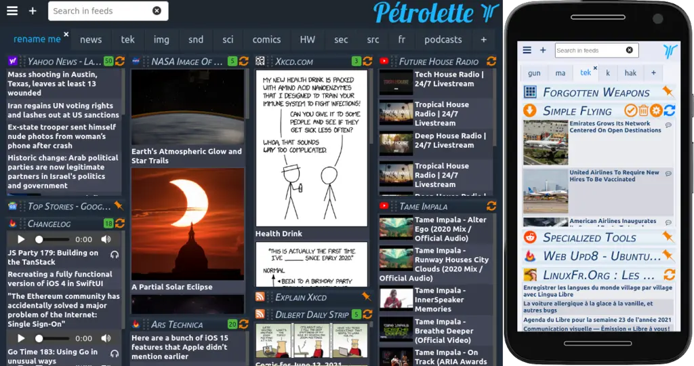

<!--
N.B.: This README was automatically generated by https://github.com/YunoHost/apps/tree/master/tools/README-generator
It shall NOT be edited by hand.
-->

# Petrolette for YunoHost

[](https://dash.yunohost.org/appci/app/petrolette)  

[](https://install-app.yunohost.org/?app=petrolette)

*[Lire ce readme en français.](./README_fr.md)*

> *This package allows you to install Petrolette quickly and simply on a YunoHost server.
If you don't have YunoHost, please consult [the guide](https://yunohost.org/#/install) to learn how to install it.*

## Overview

Pétrolette is a news reader that doesn't know you

Pétrolette is fully self-contained, makes no external call whatsoever, and embarks a total of zero tracker or "analysis" tool. Needless to say she is also completely ad-free.

The application has 2 modes 
- multi user : each user store is own config itself.
- mono user : configuration is store locally in the server. Each visitor see the same page. 

For now, there is no any mechanism included for feed protection. Any visitor can modify the feed list.


**Shipped version:** 1.6.0~ynh3

**Demo:** https://petrolette.space

## Screenshots



## Documentation and resources

* Official app website: <https://framagit.org/yphil/petrolette>
* Upstream app code repository: <https://framagit.org/yphil/petrolette>
* YunoHost Store: <https://apps.yunohost.org/app/petrolette>
* Report a bug: <https://github.com/YunoHost-Apps/petrolette_ynh/issues>

## Developer info

Please send your pull request to the [testing branch](https://github.com/YunoHost-Apps/petrolette_ynh/tree/testing).

To try the testing branch, please proceed like that.

``` bash
sudo yunohost app install https://github.com/YunoHost-Apps/petrolette_ynh/tree/testing --debug
or
sudo yunohost app upgrade petrolette -u https://github.com/YunoHost-Apps/petrolette_ynh/tree/testing --debug
```

**More info regarding app packaging:** <https://yunohost.org/packaging_apps>
