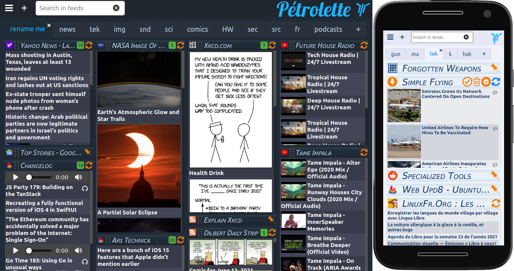

<!--
N.B.: This README was automatically generated by https://github.com/YunoHost/apps/tree/master/tools/README-generator
It shall NOT be edited by hand.
-->

# Petrolette for YunoHost

[](https://dash.yunohost.org/appci/app/petrolette)    
[](https://install-app.yunohost.org/?app=petrolette)

*[Lire ce readme en français.](./README_fr.md)*

> *This package allows you to install Petrolette quickly and simply on a YunoHost server.
If you don't have YunoHost, please consult [the guide](https://yunohost.org/#/install) to learn how to install it.*

## Overview

The news reader that doesn't know you

**Shipped version:** 1.4.9~ynh2

**Demo:** https://petrolette.space

## Screenshots



## Disclaimers / important information

- require a dedicated domain

- the application doesn't store anything locally. Restore/uprade operation is basically reinstalling the app.
## Documentation and resources

* Upstream app code repository: https://framagit.org/yphil/petrolette
* YunoHost documentation for this app: https://yunohost.org/app_petrolette
* Report a bug: https://github.com/YunoHost-Apps/petrolette_ynh/issues

## Developer info

Please send your pull request to the [testing branch](https://github.com/YunoHost-Apps/petrolette_ynh/tree/testing).

To try the testing branch, please proceed like that.
```
sudo yunohost app install https://github.com/YunoHost-Apps/petrolette_ynh/tree/testing --debug
or
sudo yunohost app upgrade petrolette -u https://github.com/YunoHost-Apps/petrolette_ynh/tree/testing --debug
```

**More info regarding app packaging:** https://yunohost.org/packaging_apps