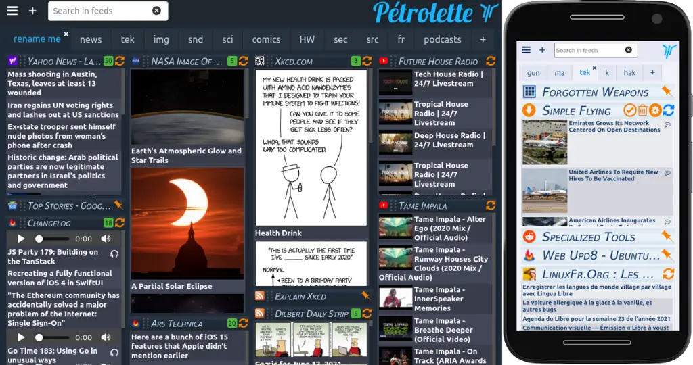

<!--
N.B.: This README was automatically generated by https://github.com/YunoHost/apps/tree/master/tools/README-generator
It shall NOT be edited by hand.
-->

# Petrolette pour YunoHost

[](https://dash.yunohost.org/appci/app/petrolette)  

[](https://install-app.yunohost.org/?app=petrolette)

*[Read this readme in english.](./README.md)*

> *Ce package vous permet d’installer Petrolette rapidement et simplement sur un serveur YunoHost.
Si vous n’avez pas YunoHost, regardez [ici](https://yunohost.org/#/install) pour savoir comment l’installer et en profiter.*

## Vue d’ensemble

La page d'actu qui ne sait rien de toi

**Version incluse :** 1.6.0~ynh2

**Démo :** https://petrolette.space

## Captures d’écran



## Avertissements / informations importantes


- The application has 2 modes 
    - multi user : each user store is own config itself.
    - mono user : configuration is store locally in the server. Each visitor see the same page. 
        /!\ For now, there is no any mechanism included for feed protection. Any visitor can modify the feed list.

- If you like this software, Please consider to [support the Pétrolette project by sending a donation](https://liberapay.com/yPhil/donate). Even the smallest amount will help a lot.

## Documentations et ressources

* Dépôt de code officiel de l’app : <https://framagit.org/yphil/petrolette>
* Documentation YunoHost pour cette app : <https://yunohost.org/app_petrolette>
* Signaler un bug : <https://github.com/YunoHost-Apps/petrolette_ynh/issues>

## Informations pour les développeurs

Merci de faire vos pull request sur la [branche testing](https://github.com/YunoHost-Apps/petrolette_ynh/tree/testing).

Pour essayer la branche testing, procédez comme suit.

``` bash
sudo yunohost app install https://github.com/YunoHost-Apps/petrolette_ynh/tree/testing --debug
ou
sudo yunohost app upgrade petrolette -u https://github.com/YunoHost-Apps/petrolette_ynh/tree/testing --debug
```

**Plus d’infos sur le packaging d’applications :** <https://yunohost.org/packaging_apps>